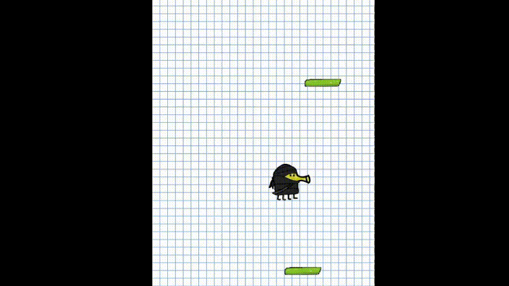

# Doodle jump

A simple clone of the popular game **Doodle jump** made with C++ and SFML.

## Build instructions
Ensure you have [cmake](https://cmake.org/) and [SFML](https://www.sfml-dev.org/) installed, as well as a 
working C++ compiler (take g++ from [gcc](https://gcc.gnu.org/), for example).

Clone the repository and cd to it:
```
git clone https://github.com/arthurdeveloper/doodle-jump
cd doodle-jump
```

Create a makefile with cmake:
```
cmake .
```

Build the executable with your platform's build tools. Using make, for example:
```
make
```

Run
```
./doodle
```

Or double click it through your UI.

## How to play?
Press the right and left arrows to move Doodle through the screen, while trying to land on the platforms. If 
you fall off the screen, you lose!
